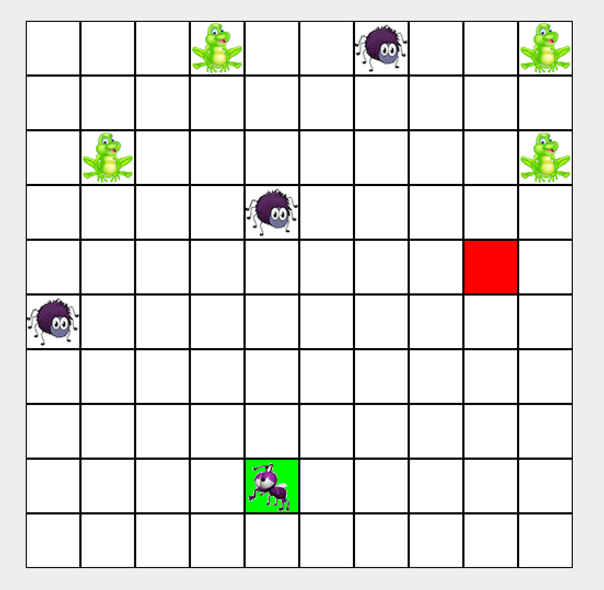
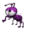

# _FLY AWAY HOME, MOSCA!_ GAME

In a land far far away, assuming a pond in the backyard, one lost little fly called Mosca just found a map home. Along its way lie hungry predators like frogs and spiders ready to hunt down and devour Mosca. "Draw" Mosca a way home on the map that also avoids such terrifying forces!

### How the world works:
Read and process a text file with the following format: the first line indicates the dimensions of the world (row x column), and the rest of the text lays out how the world is gonna look. Maybe there's no rectangular/square land with a pond but just pretend there was right now. The game characters are represented with 1 single uncapitalized letter: **s** for *start*, Mosca's starting position; **h** for *home* where Mosca needs to get; **f** for *frog*, which will likely come in multiple; **a** for *another predator*, in this case spiders, as if Mosca's livelihood is not already under imminent threat; finally, **.** for a blank square.
 **Example:** 
 a file like this
 10 10 
 ...f..a..f
 ..........
 .f.......f
 ....a.....
 ........h.
 a.........
 ..........
 ..........
 ....s.....
 ..........
 will churn out 

### How Mosca moves:
The user controls Mosca's movements by arrow keys one space at a time. Every time 

