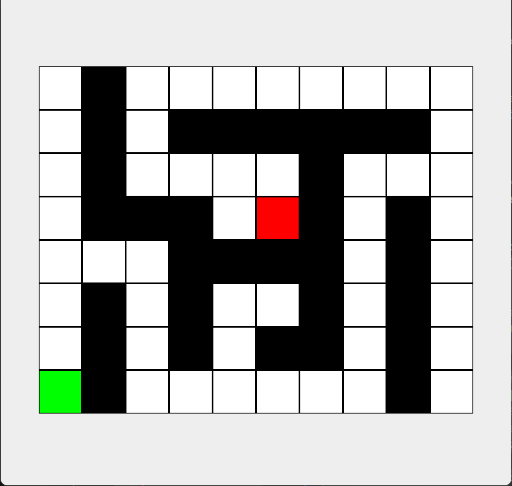
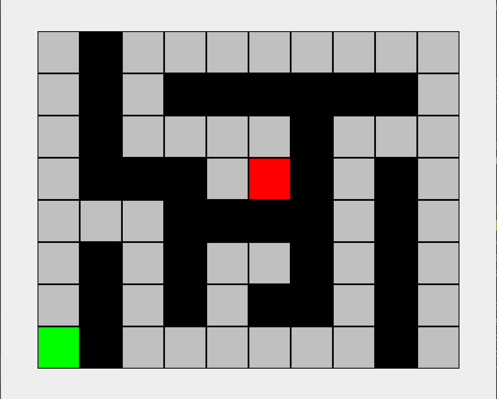
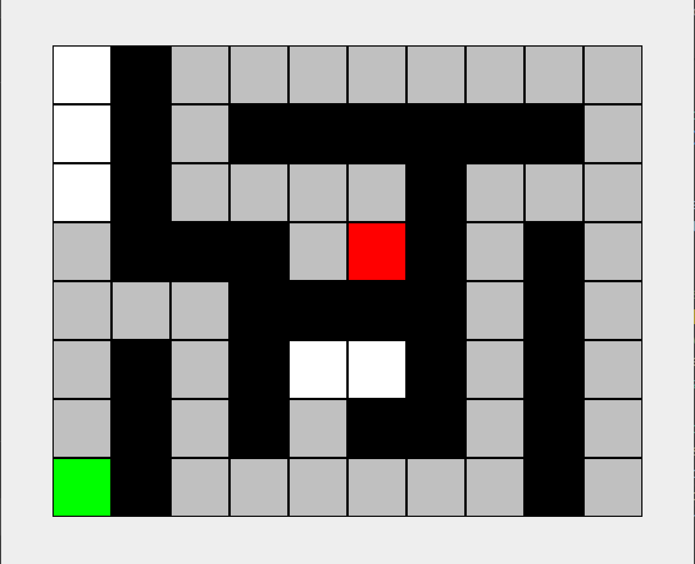
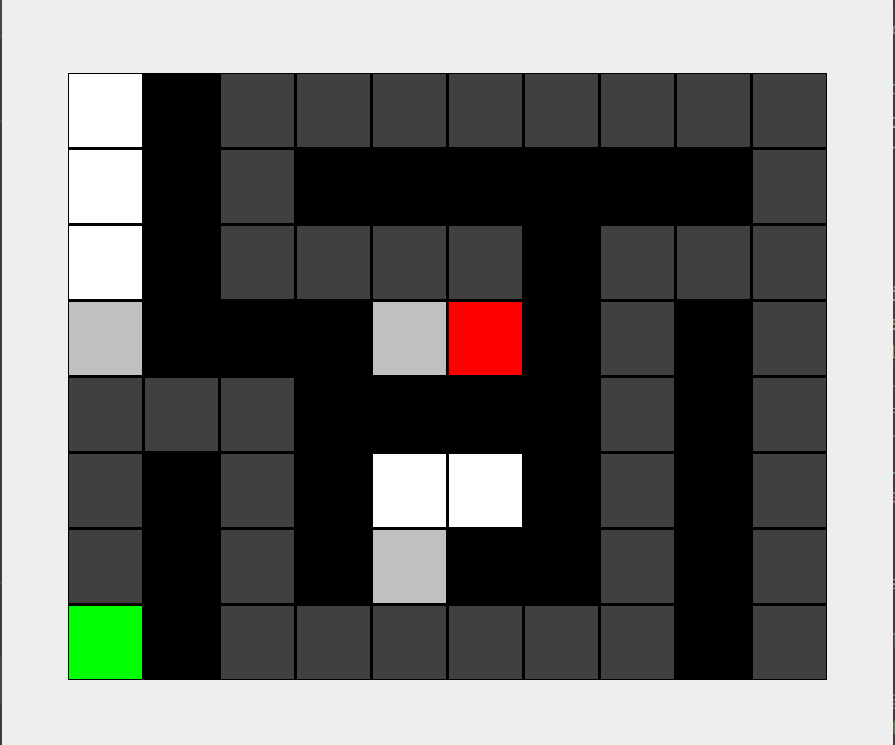
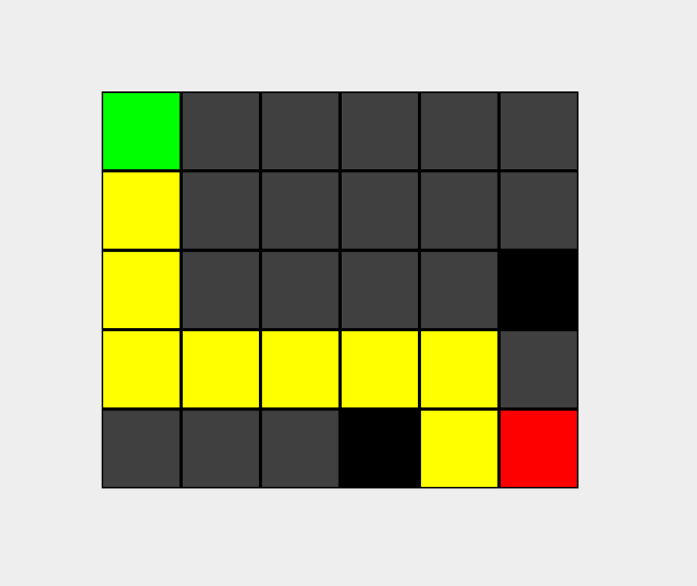
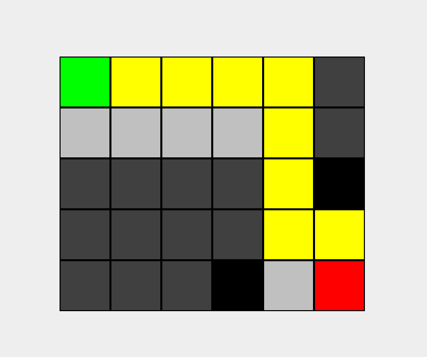

# Maze Solver: CHOOSE YOUR WEAPON

Welcome to MazeSolver, your companion in solving mazes using either stacks or queues! Embark on a thrilling journey through labyrinthine paths, where walls and deadends await your navigation skills.

## Overview
In this program, the objective is to guide a character from the start point (represented as **'o'**) to the end point (represented as **\***) in mazes without traversing walls ('#'). The program prints out the grid locations for each step of the solution path from start-goal and mark the path visually in the UI. If the goal is unreach, the program prints out **"No path found"**. The end result looks kind of sick! 🌟 

## Maze Layout
The maze layout is specified in a text file format, with the first line indicating the dimensions of the maze and subsequent lines representing the maze layout using characters like
 '#' for walls
 '.' for open spaces
 'o' for start
 '*' for goal

**EXAMPLE:**
[mazefile2.txt](https://github.com/Wabbakienph/CS2_gh/blob/main/MazeSolver/mazefile2.txt)
8 10                    
.#........
.#.######.
.#....#...
.###.*#.#.
...####.#.
.#.#..#.#.
.#.#.##.#.
o#......#.

## How to Play
- If using VS Code: Specify a launch.json with arguments the filename and whether to use a stack (**'s'**) or queue (**'q'**).
- If running in the terminal: Compile the code using javac and then run **_java MazeGUI filename s/q_**

## Algorithm Execution:
### Utilize a stack or queue algorithm, an _AGENDA_, to explore reachable neighboring locations (not wall, not edge of the maze, and not previously visited as we don't to get stuck in one place) and determine the path to the goal.

- Queues and stacks have vastly different characteristics as queues do **Breath-first search (BFS)** and stacks **Depth-first search (DFS)**. Therefore, the agenda/valid open space exploration pattern and final path will look different for these two.
- A QueueAgenda explores step-by-step all the possible ways when faced with an intersection while a StackAgenda finds a single valid way to the goal, disregarding the other open alley (Both mark valid open spaces **$\Huge{\color{lightgray}LIGHT GRAY}$**)

FOR EXAMPLE: **[mazefile2.txt](https://github.com/Wabbakienph/CS2_gh/blob/main/MazeSolver/mazefile2.txt)**

| QueueAgenda | StackAgenda |
|----------|--------|
| |  |

- While adding new open spaces , the program constantly keeps track of **visited** locations and visually update them on the GUI by marking ${\color{darkgray}DARK GRAY}$:

- A new 2D array is utilized to keep track of the parent of one or more locations (at intersections the neighboring locations all have the current location as the parent loc).
- Finally, when the solvability of the maze (can we find an unobstructed way throught to the goal or not using the agenda) is confirmed, **a solution path of the maze is constructed** through backtracking from the goal (the currLoc right now) to its parent location to the parent location of that location all the way to the start. Each parent location is added to the start of the path - so the end result is list of Maze Grid Locations from start to goal - and marked YELLOW. Obviously, there are certain difference in the final paths using a QueueAgenda vs a StackAgenda:

| QueueAgenda | StackAgenda |
|----------|--------|
| |  |

## Speculative Conclusions
Upon further testing with different maze layouts/scenarios, it seems like a Stack would find a quicker/shorter path for NARROW, MULTI-INTERSECTION mazes like **[mazefile2.txt](https://github.com/Wabbakienph/CS2_gh/blob/main/MazeSolver/mazefile2.txt)** because it explore 1 single way straight to the goal. On the other hand, more open mazes like **[mazefile3.txt](https://github.com/Wabbakienph/CS2_gh/blob/main/MazeSolver/mazefile3.txt)** and **[openMaze.txt](https://github.com/Wabbakienph/CS2_gh/blob/main/MazeSolver/openMaze.txt)** would benefit from the wide-ranging BFS approach of a **Queue** (the difference between **openMaze.txt q** and **openMaze.txt s** is enormous).

